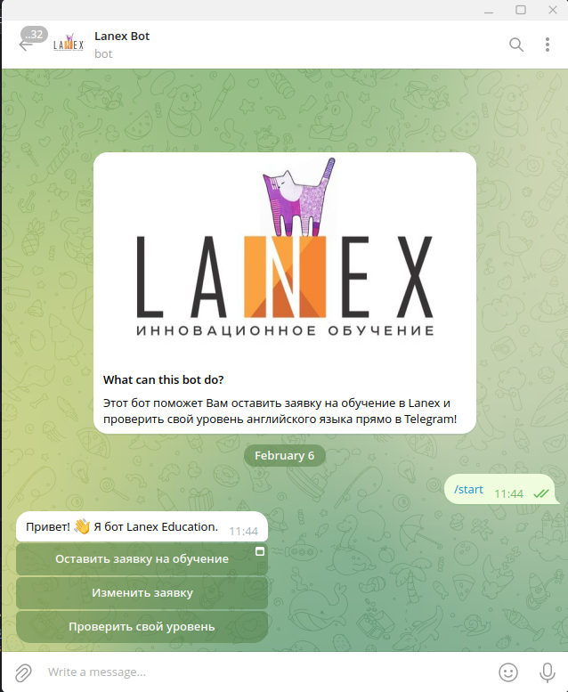
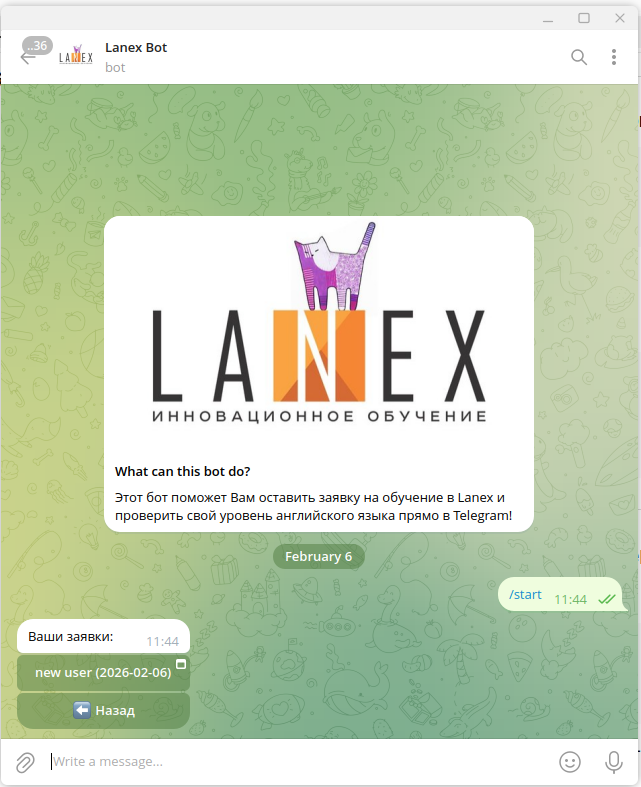
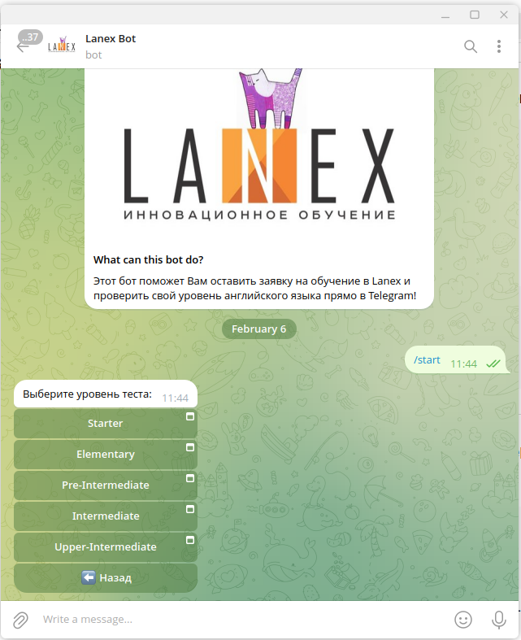
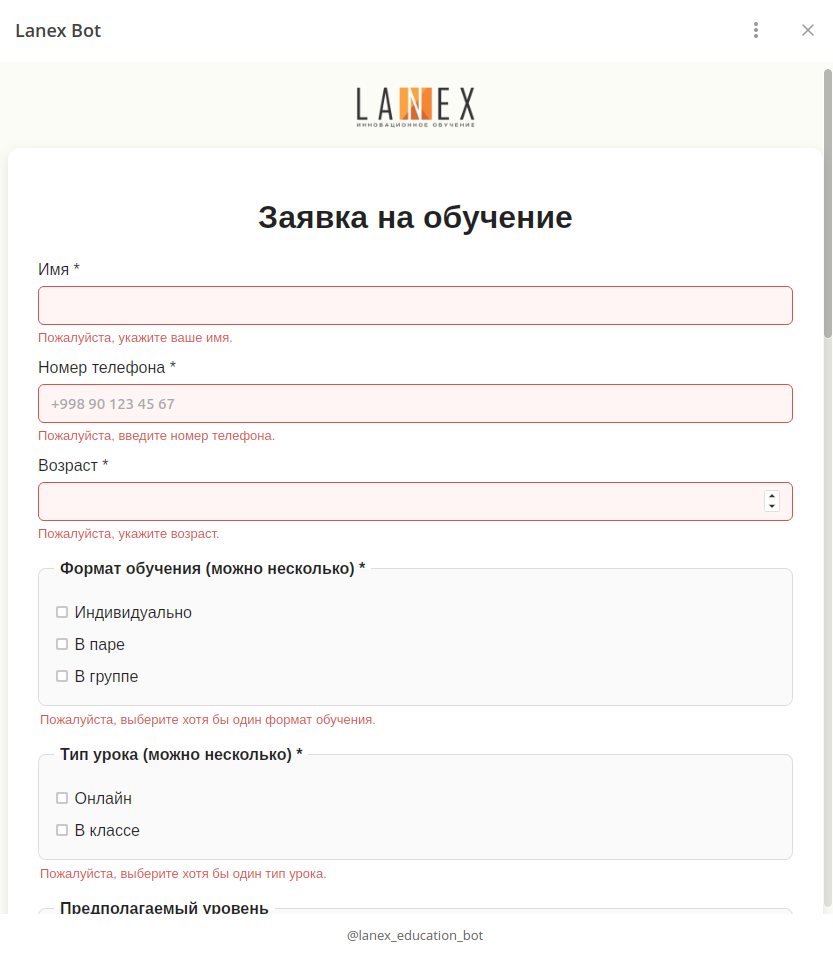
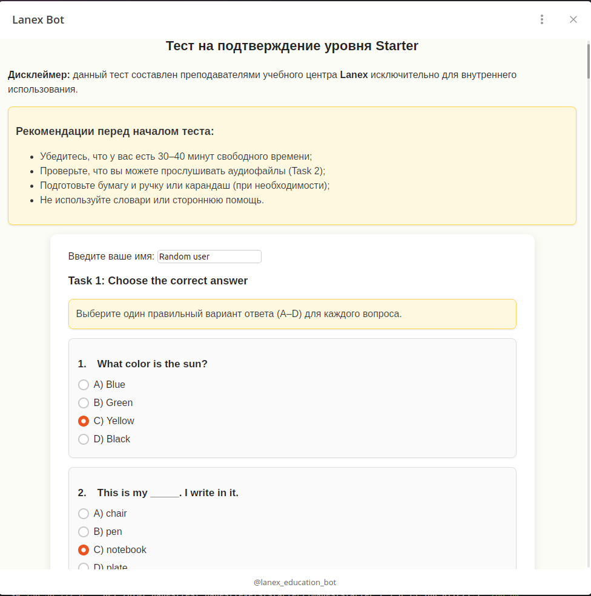
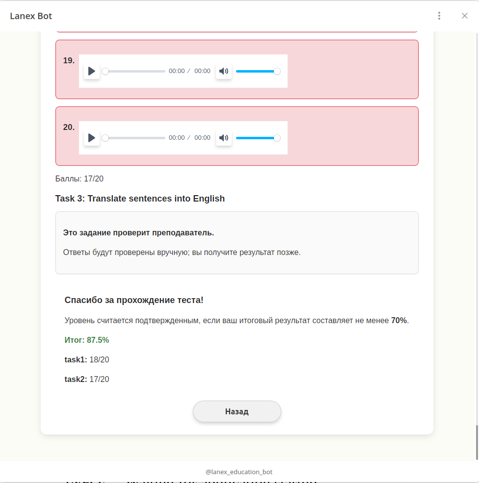
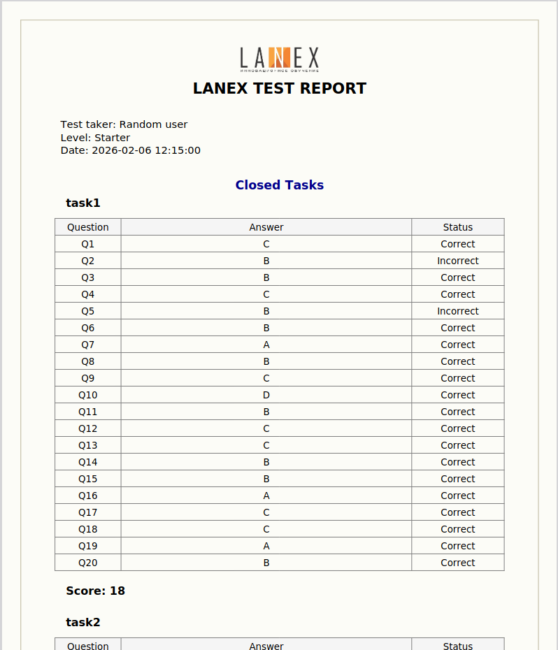
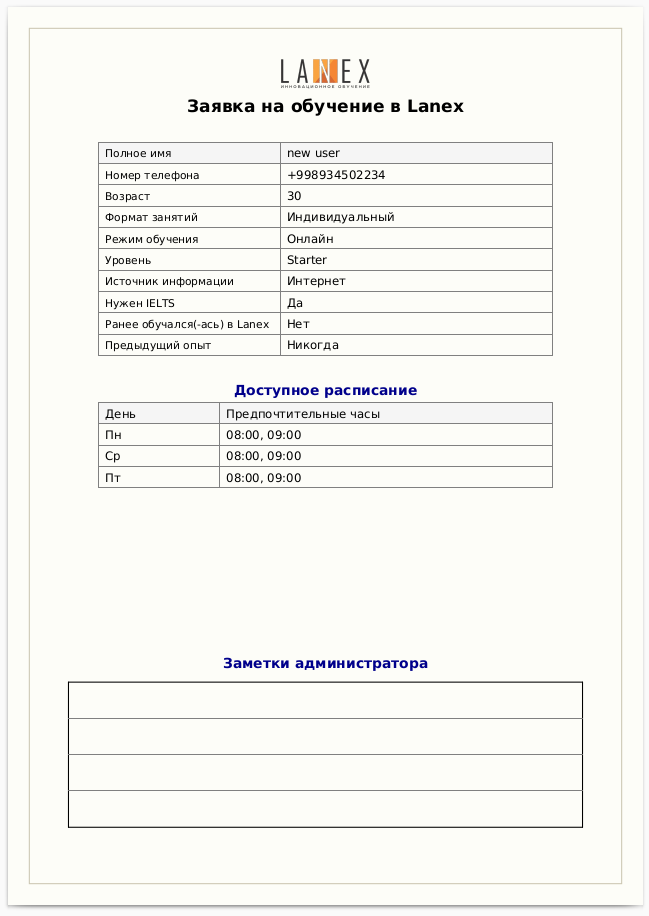

# Lanex Online Platform

**Lanex Online Platform** — образовательная платформа с интеграцией **FastAPI**, **PostgreSQL** и **Telegram-бота** для работы с заявками на обучение и тестированием уровня английского.

Платформа позволяет:
- Создавать и редактировать заявки на обучение.
- Проходить тесты на уровень владения английским.
- Генерировать PDF-отчёты PDF-заявки и хранить их в **Dropbox**.
- Интегрироваться с Telegram через WebApp и inline-клавиатуры.

---

## 📦 Стек технологий

### Backend
- FastAPI
- Aiogram (Telegram Bot API)

### База данных
- PostgreSQL
- SQLAlchemy ORM (async)

### Инфраструктура
- Docker
- Docker Compose
- Nginx

### Интеграции и сервисы
- Dropbox API (хранение файлов)
- ReportLab (генерация PDF)

### Архитектура и инструменты
- asyncio / async-await
- Встроенный logging с кастомной конфигурацией


---

## ⚙️ Установка и запуск

### 1. Клонировать репозиторий:
```bash
git clone https://github.com/RuslanKipchakov/lanex_online_platform
cd lanex_online_platform
```

### 2. Настроить переменные окружения:
Создать файл .env на основе примера:
```bash
cp .env.example .env
```
Заполнить необходимые переменные.

### 3. Запустить инфраструктуру через Docker Compose:
Поднимает:

- PostgreSQL
- Nginx
- Backend сервис

```bash
docker compose up --build
```

### 4. Создать таблицы базы данных:
```bash
poetry run python database/utils.py
```

После выполнения шагов инфраструктура и Telegram-бот будут готовы к работе.

---

## 🗂 Структура проекта

```
lanex_online_platform/
│
├── api/                  # FastAPI endpoints
├── database/             # ORM и работа с БД
├── telegram/             # Telegram Bot
├── utilities/            # Интеграции и сервисные утилиты
├── html_pages/           # WebApp frontend
│
├── config.py             # Настройки приложения
├── logging_config.py     # Конфигурация логирования
└── server.py             # Точка входа FastAPI
```

---

## 🤖 Telegram-бот

Бот построен на Aiogram и работает асинхронно вместе с FastAPI.

Основные команды и кнопки:

- /start — регистрация пользователя и главное меню
- Главное меню:
- Оставить заявку на обучение
- Изменить заявку
- Пройти тест на уровень

Динамические клавиатуры:

- Выбор уровня теста
- Просмотр и редактирование заявок пользователя

Использует WebApp для интеграции с HTML-страницами.

---

## 🌐 API Endpoints

Заявки

- POST /api/applications — создать новую заявку
- GET /api/applications/user/{telegram_id} — получить все заявки пользователя
- GET /api/applications/{id} — получить заявку по ID
- PUT /api/applications/{id} — обновить заявку

Тестирование

- POST /api/check_test — отправить ответы на тест, получить PDF и результаты

Все ответы возвращают JSON с результатами и ссылкой на Dropbox.

---

## 💾 Работа с базой данных

Используется PostgreSQL с асинхронными сессиями. Таблицы создаются вручную через:
```bash
python database/utils.py
```

Основные модели:
- UserSession — информация о пользователе и его заявках
- Application — заявки на обучение
- TestResult — результаты тестов пользователей

---

## 📄 License

MIT License

---

## 🖼 Демонстрация работы

### Telegram бот

Главное меню:



Меню заявок пользователя:



Меню уровней теста:



---

### WebApp интерфейс

Страница формы заявки




Страница прохождения теста



Страница с отображением результата тестирования



---

### PDF файлы

PDF отчёт о прохождении теста



PDF заявка на обучение

